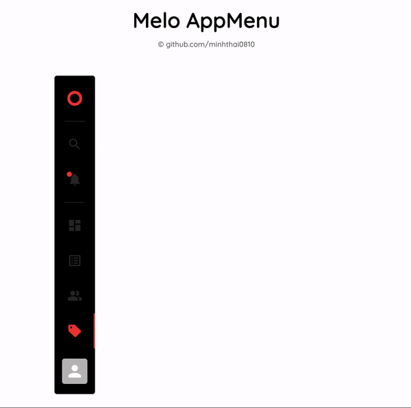

# melo-app-menu

The AppMenu component displays information and actions relating to the current screen, which is an important part of [MELO](https://melo-management.netlify.app).

## Demo



## Installation
Download node at [nodejs.org](http://nodejs.org) and install it, if you haven't already.

```sh
npm install && npm start
```